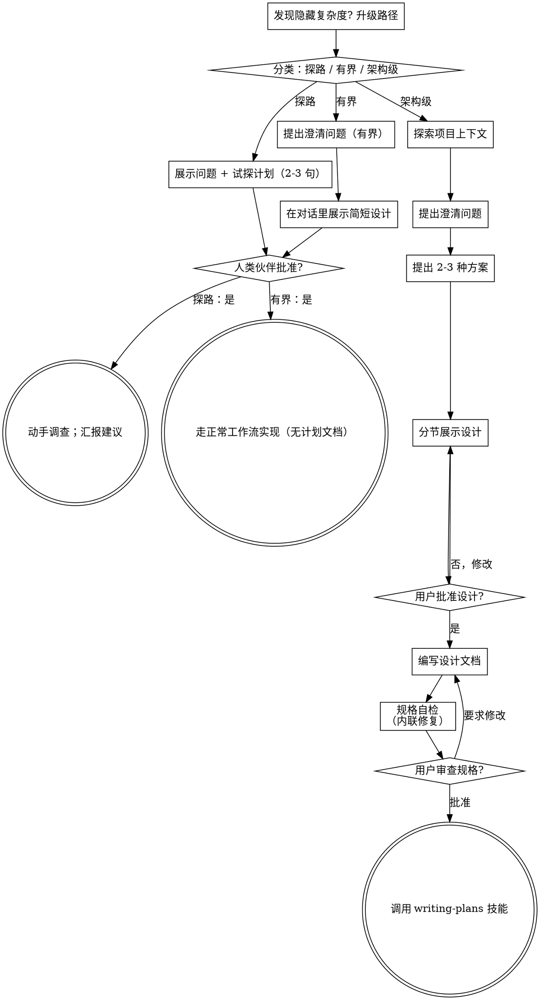

# 头脑风暴：将想法转化为设计

通过自然的协作对话，帮助将想法转化为完整的设计和规格说明。

先判断这个需求需要多少流程，然后沿着对应的路径推进：理解上下文、完善想法、展示设计、获得你的人类伙伴批准。

<HARD-GATE>
在你告诉你的人类伙伴你打算做什么、并得到他们批准之前，不要调用任何实现技能、编写任何代码、搭建任何项目或采取任何实现行动。这适用于下面**每一条路径上的每一个任务**——仪式感随任务大小缩放，批准这道关卡永远不缩放。
</HARD-GATE>

## 三条路径

在提出第一个问题之前，先给需求分类，并把分类**说出来**——"这个看起来是有界的，所以我会在这里直接给一份简短设计，而不是写规格文档"——好让你的人类伙伴能纠正你：

- **探路（Spike）** — 一个可行性问题（"我们能不能……"、"有没有可能……"、"糙一点没关系"），它的产出是一个**答案**，不是要留下的代码。用 2-3 句话说明问题和你打算怎么试，得到一个点头，然后用不牺牲正确性的最低成本去弄清楚。不写设计文档，不写规格文件。以建议的形式汇报发现；过程中搭的任何东西都明确标注为一次性的。
- **有界（Bounded）** — 对**本仓库里已经存在的代码**做范围明确的改动：加一个开关、一个小接口、改一个文件的 bug。"知道这是个什么类型的应用"不算数——有界意味着**你要改的那条流程此刻就在仓库里、可以读**。如果没有现成的流程可改，这个任务就不是有界的。问那些真正重要的澄清问题，**在对话里**给出一份简短设计（几句话到几个短段落），然后**停下**。只有在你的人类伙伴对这份设计说"可以"之后，实现才开始——有界任务的批准和架构级任务的批准是同样硬的关卡。不写规格文件，不写实现计划文档。
- **架构级（Architectural）** — 新项目、新子系统，以及会重构组件之间关系、或改动他人依赖的接口的改动。走完整流程：提问、方案对比、分节设计、书面规格，然后交给 writing-plans 技能。

在两条路径之间拿不准时，选更重的那条。这个棘轮只朝一个方向转：任务进行中发现隐藏的复杂度，就**升级**路径——停下来、说明情况、升上去。任何情况下都不在任务中途降级。

## 反模式："这个太简单了，不需要批准"

每条路径的终点都是你的人类伙伴在实现之前批准你的意图。一个待办事项列表、一个单函数工具、一个配置变更——设计可以只是对话里的两句话，但你**必须**把它展示出来并获得批准。"简单"的任务恰恰是未经检验的假设造成最多浪费的地方。随简单程度缩放的是**产出物**，永远不是批准。

## 危险信号

| 心里的想法 | 实际情况 |
|---------|---------|
| "这个太简单了，不需要设计" | 简单意味着简短的设计，不是没有设计。对话里两句话，然后获得批准。 |
| "我就说它是有界的，跳过规格文档" | 为了少干活而去够一个标签，这本身就是"拿不准"——选更重的那条路径。 |
| "它是有界的，设计也很显然——我一边让他们读一边开工" | 关卡是**批准**，不是设计的长度。展示完就停，直到听见"可以"。 |
| "这类应用我很熟，所以它是有界的" | 有界衡量的是**仓库**，不是你的熟悉程度。新项目没有现成的流程可改——那是架构级。 |
| "探路跑通了，那这些代码就留着吧" | 探路的产出是一个答案。要留下代码是一个**新的需求**——给它重新分类。 |
| "范围是变大了，但我快做完了，不用重新分类" | 隐藏的复杂度会在任务中途升级路径。停下来，说明情况。 |
| "他们批准了探路，那后续改动也算批准了" | 每个任务有自己的分类，也有自己的批准。 |

## 检查清单

先分类，宣布路径，然后为你所在路径上的每个条目创建任务，并按顺序完成。

**探路（Spike）：**
1. **探索项目上下文** — 够用来框定这次试探即可
2. **展示问题 + 试探计划** — 2-3 句话
3. **获得批准** — 一个点头就够
4. **动手调查** — 用不牺牲正确性的最低成本
5. **汇报发现** — 以建议的形式；搭出来的任何东西都标注为一次性的

**有界（Bounded）：**
1. **探索项目上下文** — 检查文件、文档、最近的 commit
2. **提出澄清问题** — 每次一个，只问那些真正重要的
3. **在对话里展示简短设计** — 思路、会动哪些文件、怎么测
4. **获得批准** — **停下**并等待一个明确的"可以"；展示完设计顺口就开工，等于跳过了关卡
5. **实现** — 走正常的开发工作流（TDD 同样适用）；不写计划文档

**架构级（Architectural）：**
1. **探索项目上下文** — 检查文件、文档、最近的 commit
2. **在需要时才提供视觉伴侣** — **不要一上来就提**。第一次遇到"这个问题画出来比说出来更清楚"时，才在那一刻提供（作为独立的一条消息）；对方同意后，浏览器标签页会为你打开。如果自始至终没出现视觉问题，就永远不要提。参见下方"视觉伴侣"部分。
3. **提出澄清问题** — 每次一个，了解目的/约束/成功标准
4. **提出 2-3 种方案** — 附带权衡分析和你的推荐
5. **展示设计** — 按复杂度分节展示，每节展示后获得用户批准
6. **编写设计文档** — 保存到 `docs/superpowers/specs/YYYY-MM-DD-<topic>-design.md` 并 commit
7. **规格自检** — 快速内联检查占位符、矛盾、模糊性、范围（详见下方）
8. **用户审查书面规格** — 在继续之前请用户审查规格文件
9. **过渡到实现** — 调用 writing-plans 技能创建实现计划

## 流程图

**终止状态跟着路径走。** 架构级：头脑风暴之后你唯一要调用的技能是 writing-plans——绝不调用 frontend-design、mcp-builder 或任何其他实现技能。有界：获得批准之后，直接走正常的开发工作流去实现，不写计划文档。探路：终止状态是一份汇报出去的建议。

## 流程详述

下面这些小节服务于**有界**和**架构级**两条路径（探路在"展示试探计划、拿到点头"就停了）。从**探索方案**往后都是架构级路径的深度——对有界的工作来说，上下文加几个问题再加一份对话里的简短设计，就是全部流程。

**理解想法：**

- 首先查看当前项目状态（文件、文档、最近的 commit）
- 在提出详细问题之前，先评估范围：如果需求描述了多个独立子系统（例如"构建一个包含聊天、文件存储、计费和分析的平台"），立即指出这一点。不要花时间用问题去细化一个需要先拆分的项目。
- 如果项目规模过大，单个规格说明无法覆盖，帮助用户分解为子项目：有哪些独立的部分，它们之间有什么关系，应该按什么顺序构建？然后通过正常的设计流程进行第一个子项目的头脑风暴。每个子项目都有自己的规格 → 计划 → 实现周期。
- 对于范围适当的项目，每次提一个问题来完善想法
- 尽量使用选择题，开放式问题也可以
- 每条消息只提一个问题——如果一个主题需要更多探索，拆分成多个问题
- 重点理解：目的、约束、成功标准

**探索方案：**

- 提出 2-3 种不同的方案及其权衡
- 以对话的方式展示选项，附上你的推荐和理由
- 先展示你推荐的方案并解释原因
- 严格遵循 YAGNI —— 从每个方案和设计里移除不必要的功能

**展示设计：**

- 一旦你认为理解了要构建的内容，就展示设计
- 每个部分的篇幅与其复杂度匹配：简单的几句话，复杂的最多 200-300 字
- 每个部分展示后询问是否正确
- 涵盖：架构、组件、数据流、错误处理、测试
- 随时准备回头澄清不明确的地方

**面向隔离和清晰的设计：**

- 将系统拆分为更小的单元，每个单元有一个明确的职责，通过定义良好的接口通信，可以独立理解和测试
- 对于每个单元，你应该能回答：它做什么，如何使用，它依赖什么？
- 别人能否不看内部实现就理解一个单元的功能？你能否在不影响调用者的情况下修改内部实现？如果不能，边界需要调整。
- 更小、边界清晰的单元也更便于你工作——你对能一次放入上下文的代码推理得更好，文件越专注你的编辑越可靠。当文件变大时，这通常意味着它承担了过多职责。

**在现有代码库中工作：**

- 在提出更改之前先探索现有结构。遵循现有模式。
- 如果现有代码存在影响当前工作的问题（例如文件过大、边界不清、职责纠缠），在设计中包含有针对性的改进——就像一个优秀的开发者在工作中改进经手的代码一样。
- 不要提议无关的重构。专注于服务当前目标的事情。

## 设计之后（架构级路径）

**文档：**

- 将验证通过的设计（规格说明）写入 `docs/superpowers/specs/YYYY-MM-DD-<topic>-design.md`
  - （用户对规格位置的偏好优先于此默认值）
- 如果可用，使用 elements-of-style:writing-clearly-and-concisely 技能
- 将设计文档 commit 到 git

**规格自检：**
编写规格文档后，以全新的视角审视它：

1. **占位符扫描：** 有没有"待定"、"TODO"、未完成的章节或模糊的需求？修复它们。
2. **内部一致性：** 各章节之间有矛盾吗？架构和功能描述匹配吗？
3. **范围检查：** 这是否聚焦到可以用一个实现计划覆盖，还是需要进一步拆分？
4. **模糊性检查：** 有没有需求可以被两种方式理解？如果有，选择一种并明确写出来。

发现问题就直接内联修复。无需重新审查——修好继续推进。

**用户审查关卡：**
规格自检完成后，请用户在继续之前审查书面规格：

> "规格已编写并 commit 到 `<path>`。请审查一下，如果在我们开始编写实现计划之前你想做任何修改，请告诉我。"

等待用户回复。如果他们要求修改，做出修改并重新运行规格自检。只有在用户批准后才继续。

**实现：**

- 调用 writing-plans 技能创建详细的实现计划
- 不要调用任何其他技能。writing-plans 是下一步。

## 视觉伴侣

一个基于浏览器的伴侣工具，用于在头脑风暴过程中展示原型、图表和视觉选项。它是一个工具——不是一种模式。接受伴侣意味着它可用于适合视觉呈现的问题；并不意味着每个问题都要通过浏览器。

**提供伴侣（在需要时才提）：** **不要一上来就提。** 等到某个问题确实"画出来比说出来更清楚"时再提——要是真正的原型 / 布局 / 图表问题，而不仅仅是话题跟 UI 沾边。第一次出现这种情况时，就在那一刻提供，作为独立的一条消息：
> "接下来这部分，我展示给你看可能更容易理解——我可以在讨论过程中，在一个浏览器标签页里做原型、图表和对比。这个功能还比较新，可能会消耗较多 token。要我打开吗？我来帮你打开。"

**此提议必须是一条独立的消息。** 只有这条提议——不含澄清问题、内容摘要或任何其他内容。等待用户回复。如果他们接受，用 `--open` 启动服务，浏览器会自动打开到第一屏。如果他们拒绝，继续纯文本进行，并且不要再提，除非他们自己提起。

**逐问题决策：** 即使用户接受了，也要对每个问题单独决定是使用浏览器还是终端。判断标准：**用户看到它是否比读到它更容易理解？**

- **使用浏览器** 展示本身就是视觉的内容——原型、线框图、布局对比、架构图、并排视觉设计
- **使用终端** 展示文本内容——需求问题、概念选择、权衡列表、A/B/C/D 文字选项、范围决策

关于 UI 主题的问题不一定是视觉问题。"在这个上下文中个性化是什么意思？"是一个概念问题——使用终端。"哪种向导布局更好？"是一个视觉问题——使用浏览器。

如果他们同意使用伴侣，在继续之前阅读详细指南：
`skills/brainstorming/visual-companion.md`
